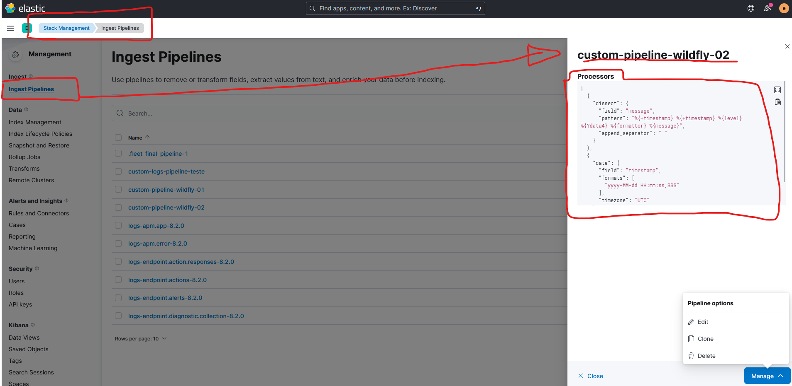
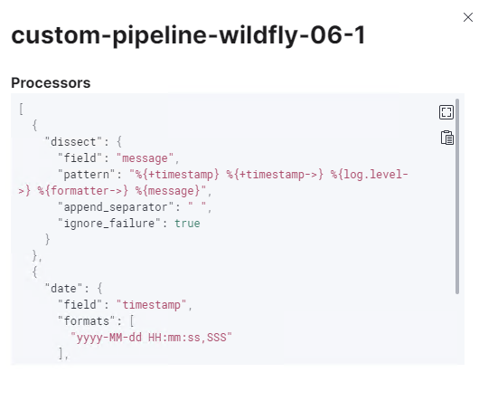

## 1

* custom-pipeline-wildfly-02



```
[
  {
    "dissect": {
      "field": "message",
      "pattern": "%{+timestamp} %{+timestamp} %{level} %{?data4} %{formatter} %{message}",
      "append_separator": " "
    }
  },
  {
    "date": {
      "field": "timestamp",
      "formats": [
        "yyyy-MM-dd HH:mm:ss,SSS"
      ],
      "timezone": "UTC"
    }
  }
]
```

### Pra testar 

```
[
  {
    "_source": {
      "message": "2022-03-11T10:59:03 WARN Hello I'm the line number 1"
    }
  }
]
```

```
[
  {
    "_source": {
      "message": "2022-05-26 09:12:08,399 INFO  [uk.ltd.getahead.dwr.impl.ExecuteQuery] (default task-5239) Exec[0]: DWROs.carregaStatusSubOs()"
    }
  }
]
```

---

##  custom-pipeline-wildfly-06-1



```
[
  {
    "dissect": {
      "field": "message",
      "pattern": "%{+timestamp} %{+timestamp->} %{log.level->} %{formatter->} %{message}",
      "append_separator": " ",
      "ignore_failure": true
    }
  },
  {
    "date": {
      "field": "timestamp",
      "formats": [
        "yyyy-MM-dd HH:mm:ss,SSS"
      ],
      "timezone": "UTC",
      "ignore_failure": true
    }
  }
]
```